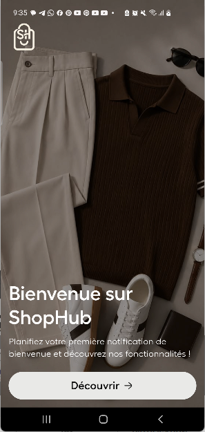
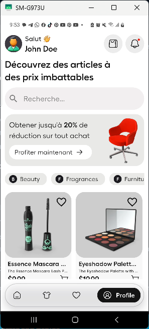
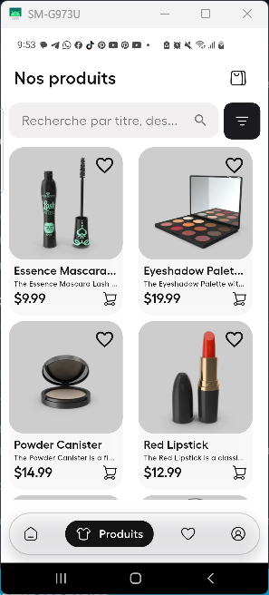
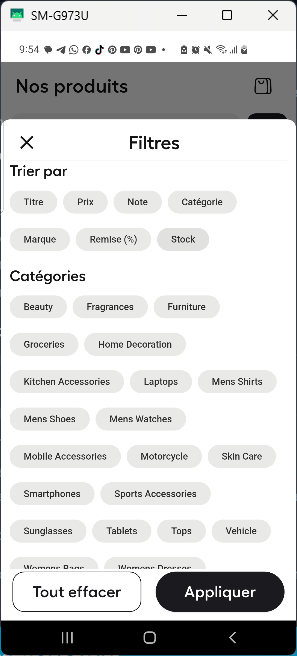
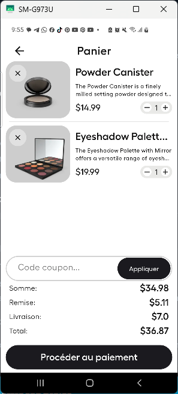

# 🛒 ShopHub — Application E-Commerce Flutter & Riverpod

[](https://flutter.dev)
[](https://dart.dev)
[](https://riverpod.dev)
[](https://pub.dev/packages/go_router)
[](#)

**ShopHub** est une application e-commerce moderne et complète construite avec **Flutter** et **Riverpod**. Elle met en avant les meilleures pratiques de développement mobile : architecture en couches (Clean Architecture), gestion d'état réactive et asynchrone avec `AsyncValue`, persistance des données locales, et une interface utilisateur (UI) soignée sous **Material 3**.

---

## 📸 Aperçu Visuel

Voici les captures d'écran représentant l'ensemble des parcours et fonctionnalités de l'application ShopHub :

| 🚀 Bienvenue | 🏠 Accueil | 📦 Catalogue Produits |
| :---: | :---: | :---: |
|  |  |  |

| 🔍 Filtres Avancés | 🛒 Panier d'Achat | 👤 Profil Utilisateur |
| :---: | :---: | :---: |
|  |  |  |

---

## 🎯 Fonctionnalités & Respect du Cahier des Charges

L'application répond rigoureusement à l'ensemble des fonctionnalités et exigences techniques demandées :

### 📋 Fonctionnalités Obligatoires Implémentées
- **Catalogue de produits (Liste + Détail)** :
  - Affichage dynamique des produits sous forme de grille interactive avec visuels, prix, réductions et notes.
  - Page de détail complète du produit (`ProductDetailPage`) présentant la description, les images, le stock et les options d'achat.
- **Panier d'Achat (Ajout, Suppression, Quantité)** :
  - Ajout rapide depuis les cartes ou la page produit.
  - Ajustement dynamique des quantités (+ / -) et suppression d'articles.
  - Calcul automatique et réactif du sous-total, des réductions appliquées et des frais de livraison.
- **Système de Favoris Persisté Localement** :
  - Possibilité de marquer/démarquer des articles en favoris.
  - Persistance locale garantie grâce à `SharedPreferences`.
  - Mise à jour optimiste du state (UI réactive sans latence) avec mécanisme de rollback en cas d'erreur.
- **Filtrage et Tri des Produits** :
  - Recherche textuelle en temps réel dans le catalogue.
  - Bottom sheet de filtres complet (`FiltersBottomSheet`) permettant de filtrer par plage de prix, catégorie et note minimale.
- **Écran de Profil Utilisateur (Mock)** :
  - Affichage et édition des informations du profil (nom, email, téléphone).
  - Gestion des préférences (mode sombre/clair, notifications).

### 🌟 Fonctionnalité Bonus
- **Animations et Retours Visuels lors de l'ajout au panier** :
  - Feedback visuel instantané via des SnackBars stylisées et des micro-animations sur les boutons de panier et d'action.

---

## 🛠️ Architecture Technologique & Clean Architecture

L'application suit une **architecture en couches (Layered / Clean Architecture)** garantissant une séparation stricte entre la logique métier, la gestion des données et l'interface utilisateur.

```
lib/
├── core/                       # Socle applicatif & utilitaires
│   ├── configs/                # Logging et configurations globales
│   ├── constants/              # Thèmes, Couleurs, Spacings, Typographies
│   ├── extensions/             # Extensions sur BuildContext et types Dart
│   ├── helpers/                # Fonctions d'aide (formatage de prix, dates)
│   ├── routing/                # Router GoRouter, AppRoutes, NavKeys
│   └── theme/                  # Management des thèmes Clair / Sombre
│
├── data/                       # Couche d'accès aux données
│   ├── datasources/            # Sources de données (Remote JSON API, Local)
│   ├── models/                 # Modèles de données (Product, CartItem, User, etc.)
│   ├── repositories/           # Implémentations des contrats de repositories
│   └── services/               # ApiService, LocalStorageService, Notifications
│
├── domain/                     # Couche métier
│   └── repositories/           # Contrats/Interfaces des repositories
│
└── presentation/               # Couche d'affichage et d'état (UI)
    ├── pages/                  # Écrans (Home, Products, Cart, Favorites, Profile, etc.)
    ├── providers/              # Injecteurs & Providers Riverpod
    │   └── state_providers/    # Notifiers et States complexes (Cart, Fav, Product)
    └── widgets/                # Composants UI réutilisables (Cards, Buttons, Inputs)
```

---

## ⚡ Focus sur Riverpod & State Management

L'application utilise **exclusivement Riverpod** (v3.x) pour l'injection de dépendances et la gestion d'état réactive. Elle intègre plus de **20 providers distincts** couvrant l'ensemble des cas d'utilisation modernes :

### 1. Gestion des états Asynchrones avec `AsyncValue`
Les états asynchrones utilisent `AsyncNotifier` et `AsyncValue`, permettant une gestion propre des 3 états UI de manière déclarative :
```dart
final productList = ref.watch(productListProvider);

return productList.when(
  data: (state) => ProductGrid(products: state.filteredProducts),
  loading: () => const ProductSkeletonLoader(),
  error: (error, stack) => ErrorDisplay(message: error.toString()),
);
```

### 2. Inventaire des Providers Utilisés

| Provider | Type Riverpod | Rôle & Description |
| :--- | :--- | :--- |
| `cartProvider` | `AsyncNotifierProvider` | Logique métier du panier : ajout, quantité, suppression et calculs de prix. |
| `favoriteProductProvider` | `AsyncNotifierProvider` | Logique des favoris avec persistance locale `SharedPreferences` et **Optimistic UI**. |
| `productListProvider` | `AsyncNotifierProvider` | Chargement du catalogue, recherche et filtrage dynamique multi-critères. |
| `userProvider` | `AsyncNotifierProvider` | Gestion de l'état du profil utilisateur et mises à jour mockées. |
| `productDetailProvider` | `FutureProvider.family` | Chargement asynchrone à la demande d'un produit par son identifiant unique. |
| `productCategoriesProvider` | `FutureProvider` | Récupération des catégories avec mise en cache (`ref.keepAlive()`). |
| `themeProvider` | `NotifierProvider` | Contrôle et basculement dynamique du thème (Clair / Sombre). |
| `networkStatusProvider` | `StreamProvider` | Écoute en temps réel de l'état de la connectivité réseau. |
| `selectedCategoryProvider` | `StateProvider` | Stockage de la catégorie sélectionnée depuis la page d'accueil. |
| `appPageProvider` | `StateProvider` | Index de la navigation active dans l'AppShell. |
| `cartRepositoryProvider` | `Provider` | Injection du dépôt de données du panier. |
| `favoriteRepositoryProvider` | `Provider` | Injection du dépôt de données des favoris. |
| `productRepositoryProvider` | `Provider` | Injection du dépôt de données des produits. |
| `userRepositoryProvider` | `Provider` | Injection du dépôt du profil utilisateur. |
| `productRemoteDataSourceProvider` | `Provider` | Source de données distant (Fake API / Remote HTTP). |
| `productLocalDataSourceProvider` | `Provider` | Source de données locale pour le mode hors-ligne. |
| `localStorageServiceProvider` | `Provider` | Service d'encapsulation de `SharedPreferences`. |
| `sharedPreferencesProvider` | `Provider` | Overriden au démarrage dans le `ProviderScope` racine. |
| `apiServiceProvider` | `Provider` | Service de requêtes HTTP sécurisé avec intercepteurs. |
| `connectivityServiceProvider` | `Provider` | Service d'écoute de la connexion Internet. |
| `notificationServiceProvider` | `Provider` | Service de gestion des notifications locales push. |
| `appRouterProvider` | `Provider` | Configuration centrale de la navigation via `GoRouter`. |

---

## 🚀 Démarrage Rapide (Comment Lancer le Projet)

### 📋 Prérequis
- [Flutter SDK](https://flutter.dev/docs/get-started/install) (`>=3.14.0`)
- [Dart SDK](https://dart.dev) (`>=3.0.0`)
- Un émulateur Android, Simulateur iOS, ou un navigateur Web.

### ⚙️ Étapes d'installation

1. **Cloner le projet sur votre machine localement** :
   ```bash
   git clone https://github.com/Just2sire/flutter_fire_shop_hub
   cd shop_hub
   ```

2. **Récupérer les dépendances Flutter** :
   ```bash
   flutter pub get
   ```

3. **Lancer l'application** :
   - Sur l'émulateur connecté ou le navigateur Web :
     ```bash
     flutter run
     ```
   - Pour spécifier une plateforme particulière (ex: Chrome ou Android) :
     ```bash
     flutter run -d chrome
     # ou
     flutter run -d android
     ```

4. *(Optionnel)* **Générer les assets & icônes native splash** :
   ```bash
   flutter pub run flutter_native_splash:create
   ```

---

## 🧪 Verification & Qualité du Code

Pour s'assurer du respect des règles d'analyse statique et de la qualité du code Dart :

```bash
# Vérification du linter
flutter analyze

# Lancement des tests unitaires
flutter test
```

---

## 📦 Packages & Dépendances Clés

- **State Management** : `flutter_riverpod`
- **Routage** : `go_router`
- **Persistance Locale** : `sharedPreferences`
- **Réseau & Connectivity** : `http`, `connectivity_plus`
- **Iconographie & UI** : `hugeicons`, Google Fonts (`Outfit`, `Fellix`)
- **Notifications** : `flutter_local_notifications`, `timezone`

---

## 📄 Licence

Ce projet est sous licence **MIT**. Vous êtes libre de l'utiliser, le modifier et le distribuer.
